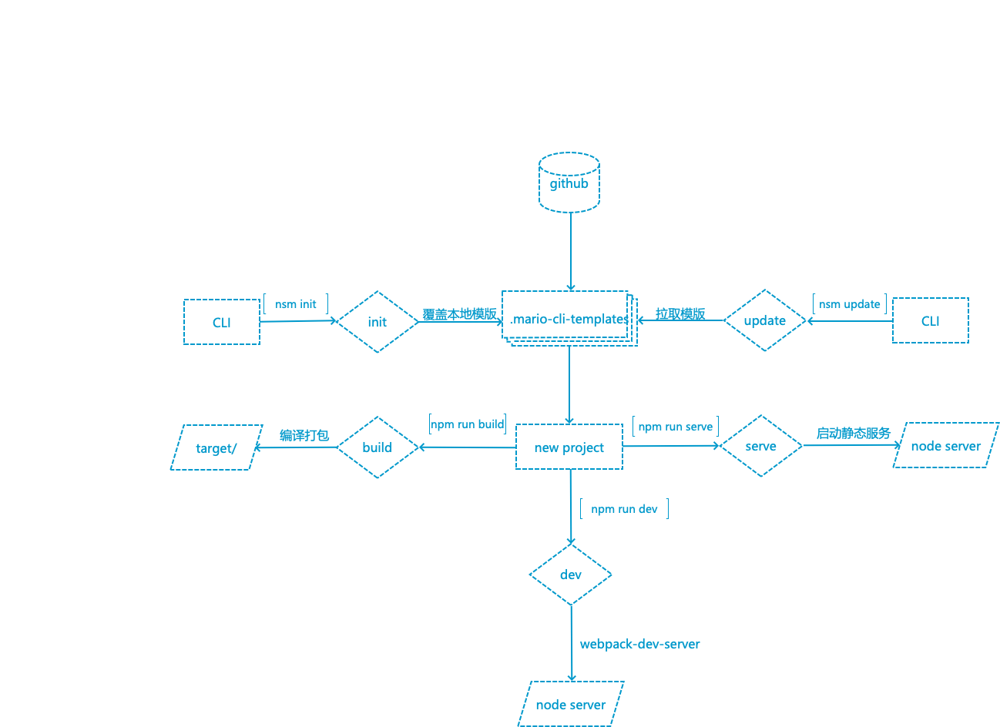

### 前端项目脚手架


> 前端基础项目模版脚手架，涵盖 react/vue 技术栈 ，目前 针对pc h5 小程序 三端，后续会持续新增项目模版如nodejs flutter 等

[![NPM version][npm-image]][npm-url]
[![npm download][download-image]][download-url]

[npm-image]: https://img.shields.io/npm/v/@nbsupermario/cli.svg?style=flat-square
[npm-url]: https://www.npmjs.com/package/@nbsupermario/cli
[download-image]: https://img.shields.io/npm/dm/@nbsupermario/cli.svg?style=flat-square
[download-url]: https://www.npmjs.com/package/@nbsupermario/cli

#### install 

```shell
npm install -g  @nbsupermario/cli 
```

#### 脚手架使用


------


- 查看已支持模版
	
	```shell
	nsm list
	```

	```shell
		 __  __            _
		|  \/  | __ _ _ __(_) ___
		| |\/| |/ _' | '__| |/ _ \
		| |  | | (_| | |  | | (_) |
		|_|  |_|\__,_|_|  |_|\___/
					
		已有模版列表：

			h5项目react基础模版 - react+antd mobile+less+webpack h5基础模版
				gitlab：https://github.com/NB-Super-Mario/template_4_h5

			pc项目react基础模版 - react+antd +less+webpack PC基础模版
				gitlab：https://github.com/NB-Super-Mario/template_4_pc

			pc项目vue基础模版 - vue+element-ui +less+sass+webpack  vue PC基础模版
				gitlab：https://github.com/NB-Super-Mario/template_4_vue

			小程序remax 基础模版 - remax less redux typescript @vant/weapp 基础模版
				gitlab：https://github.com/NB-Super-Mario/template_4_remax
	```

- 创建项目
	
	```shell
	nsm init
	```
	
- 选择项目模版

	```shell
	liyingdeMacBook-Pro:t liying$ nsm init
	? 请选择工程模版? (Use arrow keys)
	❯ h5项目react基础模版 
		pc项目react基础模版 
		pc项目vue基础模版 
		小程序remax 基础模版 
	```
	
	输入项目名称 例：t_h5
	
	```shell
	? 请选择工程模版? h5项目react基础模版
	? 请输入项目名称 t_h5
	? 当前目录创建 t_h5 项目,项目模版（h5项目react基础模版）? (Y/n) 
	```
	
- 开发调试
	
	```shell
	cd t_h5
	npm install
	npm run dev
	```
	
- 编译预览
	打包：可以通过 build:test 、build:test2、 build:test3 、build:prod build:pre 编译不通环境(目前支持template_4_h5、template_4_pc、template_4_vue 三个模版)
	
	```shell
	npm run build
	```
	
	```shell
	npm run serve # 目前支持template_4_h5、template_4_pc
	```

#### 项目模版更新(主要是项目模版配置文件记录gitlab 项目模版地址)

```shell
 nsm update
```

#### 注意

- 入需要开启调试开发日志可以在执行 nsm 命令前加入 环境变量 DEBUG=mario-cli:*  